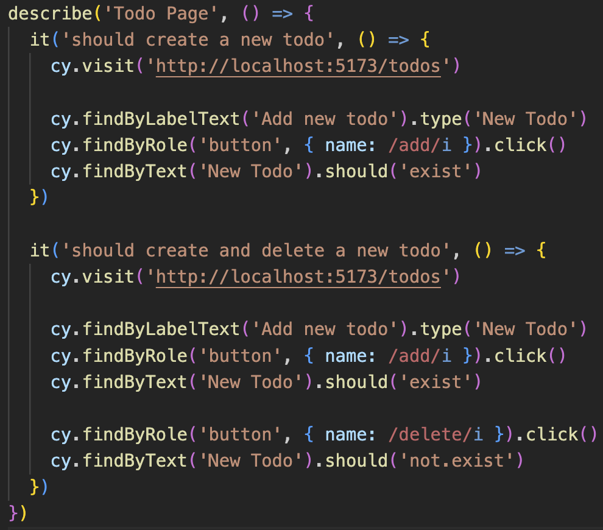

# POC CYPRESS TESTING LIBRARY

The intent of this POC is to test the [Cypress Testing Library Plugin](https://testing-library.com/docs/cypress-testing-library/).

The plugin is useful in a way that tests can be written in a way that is very similar to the way React Testing Library tests are written, without the need to add custom selectors like `data-cy` or `data-testid` attributes to the elements.

